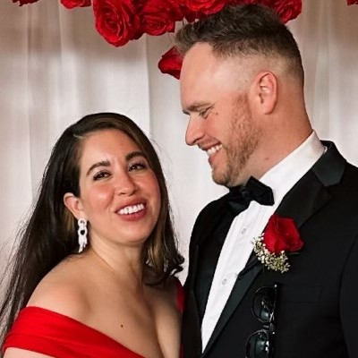

<html lang="en">
<head>
  <meta charset="UTF-8" />
  <meta name="viewport" content="width=device-width, initial-scale=1.0"/>
  <title>Bryce and Cristina's Wedding Table Chart</title>
  <link href="https://fonts.googleapis.com/css2?family=Pacifico&display=swap" rel="stylesheet">
  
</head>
<body>

  
  <h1 class="animated-title">
    
      The 
      Hend
      erso
      n's
    
  </h1>
  

  <h2 class="subheading">Welcome Please Find Your Seat</h2>
  <h3 class="subheading">05.31.2025</h3>
  

    

    <input type="text" id="searchInput" placeholder="Search for a guest name..." />
    <button id="searchButton">Go</button>
  

  

  <button id="backToTop" title="Back to Top">↑ Top</button>

</body>
</html>
